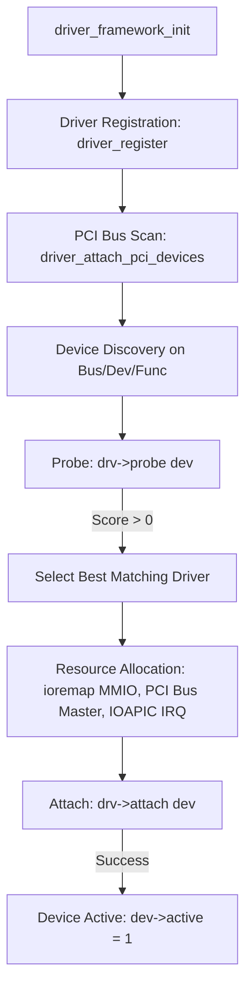

# OpenProninx Driver Framework & Subsystem Architecture

## 1. Overview & Architectural Goals

The **OpenProninx Driver Framework** provides an extensible, unified hardware abstraction layer (HAL) for device discovery, driver matching, resource allocation (MMIO, Port I/O, IRQ lines), and interrupt dispatching.

### Key Objectives
- **Decoupling hardware drivers from kernel core:** Drivers register through standardized hooks rather than requiring hardcoded checks in the interrupt handlers or entry points.
- **Automated PCI enumeration and probing:** Automatic discovery, resource extraction, and driver attachment for all devices across all PCI buses and functions.
- **Safe Memory-Mapped I/O (MMIO):** Dynamic mapping of device register spaces into the kernel's virtual memory map (`DEVSPACE`) via `ioremap()`.
- **Centralized interrupt & polling dispatching:** Hardware IRQ lines are routed directly to registered device handlers without manual vector modifications.
- **Unified Network Interface Integration:** Network drivers easily bind to the kernel networking stack (`lwIP`) via `proninx_net_interface`.

---

## 2. Core Data Structures

The framework is defined in [`kern/driver.h`](../kern/driver.h) and implemented in [`kern/driver.c`](../kern/driver.c).

### `struct driver`
Represents a device driver capable of controlling one or more devices.

```c
struct driver {
  char name[DRIVER_NAME_MAX];       // Driver identification name (e.g., "intel_e1000")
  enum bus_type bus_type;           // Target bus type: BUS_TYPE_PCI, BUS_TYPE_ISA, etc.
  enum device_type dev_type;        // Device classification: NET, BLOCK, CHAR, DISPLAY
  int (*probe)(struct device *dev); // Probe hook: returns positive match priority score
  int (*attach)(struct device *dev);// Attach hook: initializes hardware
  int (*detach)(struct device *dev);// Detach hook: graceful teardown
  void (*intr)(struct device *dev); // Hardware interrupt callback
  void (*poll)(struct device *dev); // Fallback / periodic timer polling hook
};
```

### `struct device`
Represents an instance of an attached hardware device.

```c
struct device {
  char name[DEVICE_NAME_MAX];       // Interface or device name (e.g., "em0", "vtnet0")
  enum device_type type;            // Device classification
  enum bus_type bus;                // Parent bus
  struct driver *driver;            // Bound driver pointer
  void *driver_data;                // Driver-private state pointer
  struct pci_device pci;            // PCI configuration metadata (if on PCI)
  int irq;                          // Assigned interrupt line
  void *mmio_vaddr;                 // Kernel virtual address for MMIO registers
  uint32_t mmio_paddr;              // Physical base address of MMIO space
  uint32_t mmio_size;               // Size of MMIO window in bytes
  uint16_t io_base;                 // Base I/O port (for Port-mapped I/O)
  int active;                       // Activation flag (1 = operational)
};
```

---

## 3. Driver Lifecycle & Attachment Process

The device attachment workflow follows a strict multi-stage lifecycle:



### 1. Registration (`driver_register`)
Drivers register themselves during kernel boot (e.g. `e1000_driver_init()` in `main.c`). The driver structure is stored in the global driver table.

### 2. Enumeration & Probing
`driver_attach_pci_devices()` iterates through all PCI buses (0–255), devices (0–31), and functions (0–7):
1. Reads PCI Vendor ID and Device ID.
2. Populates a temporary `struct device` with BAR configurations and IRQ line.
3. Invokes the `probe()` callback of each registered PCI driver. The driver evaluates compatibility and returns a match priority score (e.g. 100 for high-fidelity native match, 50 for generic fallback).

### 3. Resource Mapping & Activation
When a driver is selected:
1. An official `struct device` slot is allocated.
2. If the device uses MMIO (`dev->mmio_paddr != 0`), `ioremap()` maps the physical BAR range to kernel virtual address space.
3. PCI Bus Mastering and Memory/IO access are enabled via `pci_enable_bus_master()`.
4. If an IRQ line is assigned, the corresponding IOAPIC entry is unmasked via `ioapicenable(dev->irq, 0)`.
5. `drv->attach(dev)` is called to perform device-specific register setup.
6. The device is marked active.

---

## 4. Memory-Mapped I/O (MMIO) & `ioremap`

In OpenProninx 64-bit virtual memory layout:
- `DEVSPACE_PHYS` is configured at `0xe0000000` (512 MiB window from `0xe0000000` to `0x100000000` / 4 GiB).
- `DEVSPACE_P2V(a)` maps physical addresses directly to higher-half kernel space:
  `0xffffffff00000000 + phys_addr` (e.g. `0xffffffffe0000000` .. `0xffffffffffffffff`).

```c
void *ioremap(uintptr_t phys_addr, uint size) {
  if (phys_addr >= DEVSPACE_PHYS) {
    return DEVSPACE_P2V(phys_addr);
  }
  return P2V(phys_addr);
}
```

Drivers access device registers via 32-bit volatile pointers:
```c
volatile uint32_t *regs = (volatile uint32_t *)dev->mmio_vaddr;
#define REG_READ(offset)  (*(volatile uint32_t *)((uintptr_t)regs + (offset)))
#define REG_WRITE(offset, val) (*(volatile uint32_t *)((uintptr_t)regs + (offset)) = (val))
```

---

## 5. Interrupt & Polling Dispatching

Hardware interrupts routed by the IOAPIC trigger the kernel trap handler in [`kern/trap.c`](../kern/trap.c).

### Interrupt Handler
```c
// In kern/trap.c
default:
  if (tf->trapno >= T_IRQ0 && tf->trapno < T_IRQ0 + IRQ_SPURIOUS &&
      driver_dispatch_irq(tf->trapno - T_IRQ0)) {
    lapiceoi();
    break;
  }
```

`driver_dispatch_irq(irq)` traverses active devices and invokes `dev->driver->intr(dev)`.

### Polling Fallback
To safeguard against lost interrupts or firmware latency, the timer tick (10 ms period) executes `driver_poll_all()`, which invokes `dev->driver->poll(dev)` for active devices.

---

## 6. Intel E1000 Driver Implementation Walkthrough

The Intel E1000 driver ([`kern/net/e1000.c`](../kern/net/e1000.c)) provides full Gigabit Ethernet support for Intel 82540EM, 82545EM, 82543GC, 82574L, and related controllers.

### Probing
Matches Intel PCI Vendor ID `0x8086` and device IDs (`0x100e`, `0x100f`, `0x1004`, `0x10d3`, etc.).

### Initialization Sequence
1. **Device Reset:** Asserts `E1000_CTRL_RST`, waits 20 µs, deasserts reset.
2. **Link Configuration:** Enables Full Duplex (`CTRL_FD`), Auto-Speed Detection (`CTRL_ASDE`), and Link Up (`CTRL_SLU`).
3. **MAC Address Extraction:** Reads Receive Address Registers `RAL0`/`RAH0` or falls back to EEPROM words 0..2 via `EERD`.
4. **Transmit Descriptor Ring (TX):**
   - 64 descriptors (`struct e1000_tx_desc`), aligned to 16 bytes.
   - Base address written to `TDBAL` / `TDBAH`.
   - Length written to `TDLEN`.
   - `TCTL` configured with `TCTL_EN | TCTL_PSP | (15 << 4) | (64 << 12)`.
   - `TIPG` configured for IEEE 802.3 inter-packet gap.
5. **Receive Descriptor Ring (RX):**
   - 64 descriptors (`struct e1000_rx_desc`), each populated with a 2048-byte `kalloc()` buffer.
   - Base address written to `RDBAL` / `RDBAH`.
   - `RDH` set to `0`, `RDT` set to `63` (giving hardware ownership of all buffers).
   - `RCTL` configured with `RCTL_EN | RCTL_BAM | RCTL_BSIZE_2048 | RCTL_SECRC`.
6. **Interrupt Mask:** Enables `RXT0` (RX timer), `TXDW` (TX descriptor writeback), `LSC` (link status change), `RXO` (overrun), `RXDMT0` (threshold).
7. **Network Binding:** Registers `em0` with `proninx_net_register()`.

---

## 7. How to Write a New Device Driver

To implement a new driver in OpenProninx:

### Step 1: Define Driver Operations
```c
#include "driver.h"
#include "defs.h"

static int mydriver_probe(struct device *dev) {
  if (dev->bus == BUS_TYPE_PCI && dev->pci.vendor_id == 0x1234 && dev->pci.device_id == 0x5678)
    return 100; // Match score
  return 0;
}

static int mydriver_attach(struct device *dev) {
  cprintf("MYDEV: Initializing hardware at MMIO 0x%p\n", dev->mmio_vaddr);
  // Perform device initialization...
  return 0;
}

static void mydriver_intr(struct device *dev) {
  // Handle interrupt...
}

static struct driver mydriver = {
  .name = "my_custom_driver",
  .bus_type = BUS_TYPE_PCI,
  .dev_type = DEVICE_TYPE_CHAR,
  .probe = mydriver_probe,
  .attach = mydriver_attach,
  .detach = 0,
  .intr = mydriver_intr,
  .poll = 0,
};

void mydriver_init(void) {
  driver_register(&mydriver);
}
```

### Step 2: Register in `kern/defs.h` & `kern/main.c`
In `kern/main.c`:
```c
mydriver_init();
```
The driver will automatically be probed and attached when `driver_attach_pci_devices()` runs!
