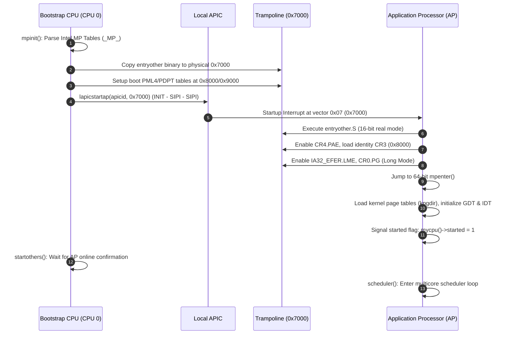

# OpenProninx Symmetrical Multiprocessing (SMP) Architecture

## 1. Overview

OpenProninx features full 64-bit Symmetrical Multiprocessing (SMP) on x86-64 hardware. All available application processors (APs) are discovered at boot, brought up through the APIC INIT-SIPI-SIPI sequence, transitioned through 16-bit real mode into 64-bit long mode via a dedicated trampoline, and integrated into the multicore kernel scheduler.

---

## 2. Boot Flow & Processor Topology

The SMP startup sequence consists of the following phases:



---

## 3. Trampoline (`kern/entryother.S`)

Application Processors start execution in 16-bit Real Mode at physical address `0x7000` (specified by the SIPI vector `0x07`).

1. **Real Mode Setup:** Loads temporary 16-bit GDT at `0x7000` and enables protected mode (`CR0.PE`).
2. **32-bit Protected Mode:** Enables Physical Address Extension (`CR4.PAE = 1`).
3. **Paging:** Loads identity page tables located at `0x8000` into `CR3`.
4. **Long Mode Activation:** Sets `IA32_EFER.LME = 1` via MSR `0xC0000080` and enables paging (`CR0.PG = 1`).
5. **64-bit Jump:** Jumps to 64-bit trampoline entry point, loads the allocated kernel stack pointer, and calls `mpenter()`.

---

## 4. APIC INIT-SIPI-SIPI Sequence (`kern/lapic.c`)

The BSP controls AP startup using the Local APIC Interrupt Command Register (ICR):

```c
void lapicstartap(uchar apicid, uint32_t addr) {
  // 1. Assert INIT Level de-assert
  lapicw(ICRHI, apicid << 24);
  lapicw(ICRLO, ICR_INIT | ICR_LEVEL | ICR_ASSERT);
  microdelay(200);

  lapicw(ICRLO, ICR_INIT | ICR_LEVEL);
  microdelay(10000); // 10 ms delay

  // 2. Send two Startup IPIs (SIPI) pointing to page vector (addr >> 12)
  for (int i = 0; i < 2; i++) {
    lapicw(ICRHI, apicid << 24);
    lapicw(ICRLO, ICR_STARTUP | (addr >> 12));
    microdelay(200);
  }
}
```

---

## 5. Scheduler & Synchronization

- Each CPU maintains its own private `struct cpu` state containing its Local APIC ID, per-core stack, GDT, interrupt nesting count (`ncli`), and current process pointer (`proc`).
- Process scheduling is fully preemptive across cores with per-process and per-subsystem spinlocks (`proc.lock`, `tickslock`, `net_lock`).
